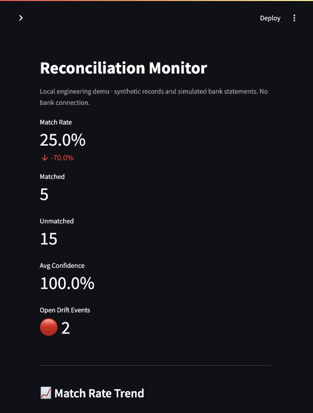
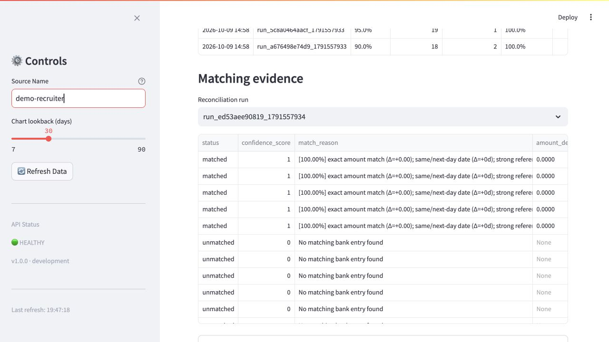
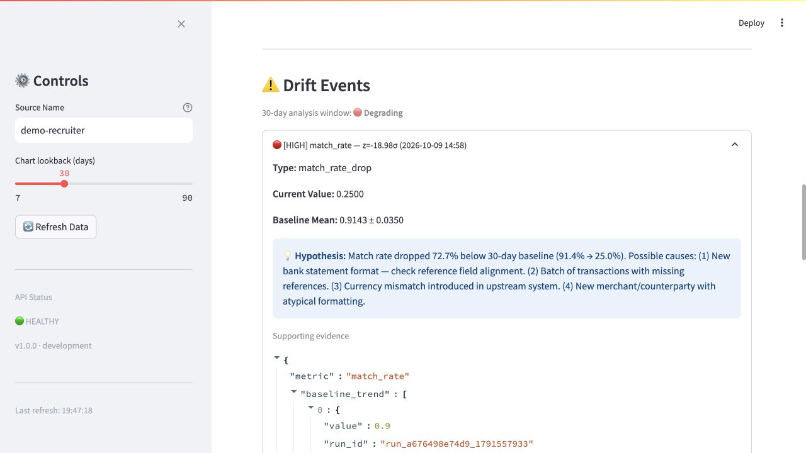
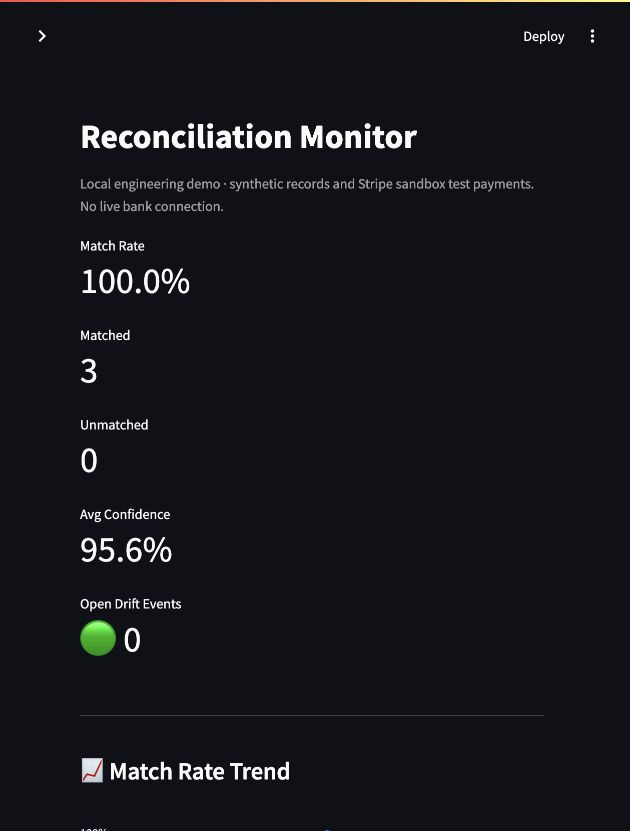

# Drift Recon

A financial reconciliation and data-drift service built by **Donatus Gwer**. It compares internal transaction records with statement rows, explains matching confidence, and flags changes in reconciliation quality.

[](https://github.com/Gwerdonatus/drift-recon/actions)

An unmatched payment is one problem. A sudden change from a normally high match rate to many unmatched payments is a different problem: something upstream may have changed. Drift Recon makes both visible, with the evidence behind each signal.

This is a solo engineering project demonstrated with **synthetic records, simulated bank statements and real Stripe sandbox API evidence**. It does not connect to a bank, move funds or establish an accounting balance.

## Walk through the actual application

### Monitor reconciliation quality

The Streamlit dashboard shows match rate, matched and unmatched counts, confidence trends, run history and open drift events. Review candidates are displayed separately from unmatched records. Average confidence describes scored matched/review pairs; 100% confidence on five matches can coexist with fifteen unmatched records and a 25% match rate.



### Inspect why records matched

Matching first requires the same currency, amount sign and date window. Eligible pairs receive a weighted score:

```text
confidence = 0.50 × amount score
           + 0.25 × date score
           + 0.15 × reference score
           + 0.10 × description score
```

Exact agreement across all four factors scores 1.00. The default automatic-match threshold is 0.75; candidates from 0.50 to below 0.75 enter review. The engine assigns the highest-scoring available pairs greedily, consuming each record at most once. This is an explainable heuristic, not a trained model or guaranteed globally optimal assignment.



### Investigate a change in the baseline

The staged demonstration creates seven varying, high-match-rate runs, followed by a run where only five of twenty internal records have statement counterparts. The service compares the latest snapshot with earlier snapshots inside its lookback window and records high-severity drift evidence.



A hypothesis suggests where to investigate; it does not prove the root cause. The demo runs are generated locally, not collected over thirty days of production traffic.

The [API contract screenshot](docs/screenshots/api.jpg) shows the actual ingestion, reconciliation, review and drift endpoints.

## Stripe sandbox reconciliation

The optional connector uses **GET requests only** to Stripe. The dashboard shows connection status and offers **Sync Stripe sandbox** to import successful captured charges for the last 31 days. Repeating the sync skips existing balance transaction IDs. Credentials stay in the ignored server-side `.env`; `sk_live_` credentials are rejected.

Charges are isolated by account and currency. Matching requires the exact payment-intent reference before applying the confidence score. Amounts are gross charges; fee, net and balance-availability fields are retained as evidence. This does **not** confirm a bank deposit or payout. Supported currencies are USD, EUR, GBP, NGN and JPY; refunds, disputes, payouts and currency-converted charges are outside this connector's scope.

The verified local example compared three independently exported TxCore settled payments ($3, $5 and $25) with three Stripe sandbox charges: **3 matched, 0 unmatched, $33 gross, 100% match rate**. Repeated provider sync and internal import created no duplicate rows. One reconciliation run is insufficient for a historical drift baseline.



[View the connected sandbox status](docs/screenshots/stripe-connection.jpg)

See [the sandbox integration runbook](docs/stripe-sandbox.md) for setup and the independent internal-record import.

## Implemented behavior

| Area | Behavior |
|---|---|
| CSV ingestion | Column normalization, validated rows, deterministic batch IDs and database duplicate protection |
| Quarantine | Invalid rows retain their original data and failure reason |
| Matching | Currency eligibility, weighted confidence, one-to-one greedy assignment and review candidates |
| Run safety | Per-source transaction locks and request-local threshold settings |
| Drift | Latest-run snapshots, historical baselines, severity, hypotheses and evidence |
| Repeat analysis | Existing snapshot/metric signals are not duplicated |
| Human review | API records a verdict alongside the original engine decision |
| Scheduling | One scheduler owner, PostgreSQL-persisted jobs and database-discovered sources |
| Access | API-key-authenticated business endpoints; dashboard with read-only Stripe provider access and local sync |
| Operations | Docker Compose, database-aware health checks and structured request logs |

## Run locally

Changes are on [`fix/recruiter-demo`, PR #1](https://github.com/Gwerdonatus/drift-recon/pull/1), pending review.

```sh
git clone https://github.com/Gwerdonatus/drift-recon.git
cd drift-recon
git switch fix/recruiter-demo
python3 scripts/configure_local.py
docker compose -p drift-recon config --quiet
docker compose -p drift-recon up -d --build --wait --wait-timeout 300
python3 scripts/demo.py
python3 scripts/demo.py
```

The configuration command generates private development credentials once and preserves an existing `.env`. Startup runs migrations automatically. The demo asserts ingestion retries, reconciliation counts, quarantine and high-severity drift. Repeating a completed demo preserves its eight-run history.

| Interface | URL |
|---|---|
| Dashboard | http://localhost:8502 |
| Dashboard through Nginx | http://localhost:8082 |
| API contract | http://localhost:8200/docs |
| Health | http://localhost:8200/health |

Select source **demo-recruiter** in the dashboard. No dashboard login is supplied; it is a local monitoring interface with a sandbox import button. Its API key is server-side. All host ports bind to loopback, with PostgreSQL and Redis private to Compose. Sentinel and TxCore can remain running on their own ports.

[Walkthrough and verification](docs/verification.md) · [Engineering decisions](docs/engineering.md) · [Local runbook](RUNBOOK.md) · [Screenshot provenance](docs/screenshots/README.md)

## Verify

Local verification: **87 passing tests · 77.01% backend coverage** against PostgreSQL.

The full suite uses a separate PostgreSQL test database. The check script never drops the application database.

```sh
# Create this isolated database once; preserve it for subsequent checks.
docker compose -p drift-recon exec postgres psql -U recon_user -d reconciliation -c 'CREATE DATABASE recon_test'
docker compose -p drift-recon run --rm --no-deps --user 0 --entrypoint sh \
  -v "$PWD:/app" api -c 'ruff check app/ tests/ && black --check app/ tests/ && python -m scripts.check_local'
```

Tests mock some service boundaries; the separate HTTP demo exercises the running API and real PostgreSQL persistence. CI runs lint, formatting and tests. Mypy remains advisory in the existing workflow; it is not represented as a passing strict type gate. No throughput, p95 latency or production traffic figure is claimed.

## Boundaries

- This is an API-key-controlled service with a shared local dashboard, not a multi-tenant financial platform or an authenticated analyst portal.
- Matching is heuristic. It does not establish that funds settled, and currencies are not converted.
- Review verdicts are recorded; they do not train a model or automatically rewrite ledger state.
- Drift uses snapshots inside a time window, not necessarily one observation per day. A constant baseline produces no meaningful z-score and is not flagged by this statistical method.
- Invalid-row submissions retain quarantine evidence; repeated invalid submissions can create additional quarantine records. Valid financial rows deduplicate by external ID and source.
- The dashboard and API-key identities do not provide named-user authorization or reliable analyst attribution. Review/resolve names are caller-supplied labels.
- One API process owns the scheduler. Horizontal scaling requires separate scheduling ownership. PostgreSQL advisory locks serialize runs for each source.
- Local HTTP configuration is not a hardened public deployment. TLS templates are retained separately; their deployment, dependency security review, backups/restores and high availability have not been verified here.

## Repository map

| Path | Purpose |
|---|---|
| `app/services` | CSV ingestion, matching and drift analysis |
| `app/api/v1` | Ingestion, reconciliation, review and drift endpoints |
| `app/models` | Transactions, statements, results, snapshots and quarantine |
| `app/workers` | Persistent scheduled reconciliation and drift checks |
| `dashboard` | Actual Streamlit monitoring interface |
| `tests` | Unit and PostgreSQL regression tests |
| `scripts/demo.py` | Asserted synthetic HTTP scenario |
| `docs` | Evidence, decisions and actual screenshots |

**Donatus Gwer — Backend Engineer** · [GitHub](https://github.com/Gwerdonatus) · [LinkedIn](https://linkedin.com/in/donatus-gwer)
